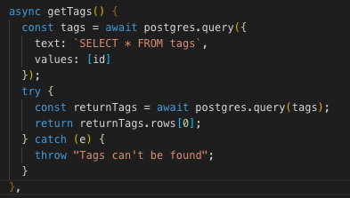
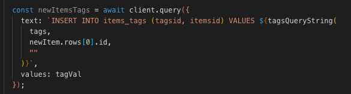

# Boomtown 🏙

## Server

Commands must be run from the `server` directory:

### Installation

```bash
npm install
```

### Run

```bash
npm run start:dev
```

### Tests

Just linting:

```bash
npm run lint
```

Run linting, and fix any errors:

```bash
npm run lint:fix
```

Run Jest tests:

```
npm run jest
```

Run Jest tests, and watch for changes:

```bash
npm run jest:watch
```

Run all tests:

```bash
npm run test
```

## Client

Commands must be run from the `client` directory:

### Installation

```bash
npm install
```

### Run

```bash
npm start
```

### Build

```bash
npm run build
```

### Tests

Just linting:

```bash
npm run lint
```

Run linting, and fix any errors:

```bash
npm run lint:fix
```

Run all tests:

```bash
npm run test
```

# Project-01-Boomtown-Part1

## Personal learnings

### GraphQL
- The biggest takeaway from GraphQL was that it required less work to create connections rather than using a REST API
- This supplies the client side with exactly what it needs from the data
- GraphQL also makes it really easy to collect data from multiple sources 
- In order for GraphQL to perform all of its tasks, it requires a Schema, Resolver and a Query.
- The way I interpreted GraphQL was just like a trusty assistant who performs certain tasks for you but in a more efficient way.

### Express

- Express connects GraphQL to Node and Express is also the simplest way to run a GraphQL API server.
- Always define Express on server side

### JavaScript
- With Async functions, this automatically transforms a regular function into a promise.
- On top of that, I realized that when dealing with Async/Await, errors appear most of the time when there aren't any try and catch methods in Async functions. This is because the promise generated by the call of the Async function becomes rejected if there isn't a try and catch method.
- Inside of the try method, a call to the await query is required. Which is was needs to be executed first and if doesn't, the catch handles it and throws an error message.



- The biggest takeaway from the pg-resource.js file was that it was responsible for firing SQL Queries to grab everything that was needed from the database itself.
- Each of those Queries that were being fired was from a "text:" insert placeholder.
- being able to add a function into a text Query e.g.(tagsQueryString();) gave the postgres command more accessibility to grab important data from pg-resource.js


